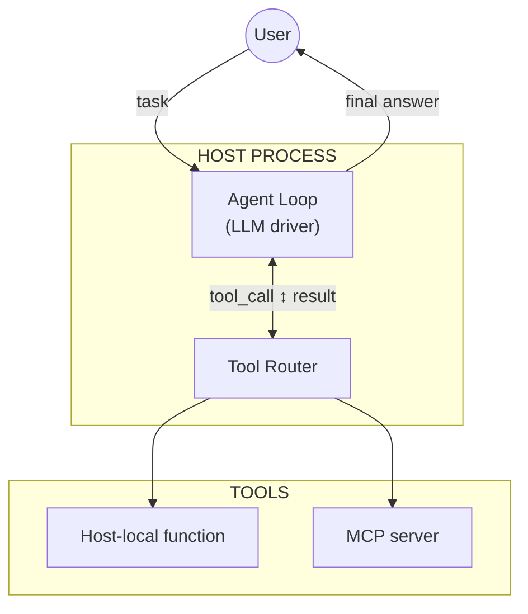
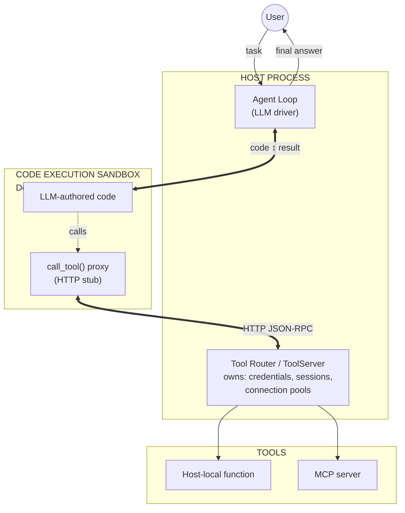
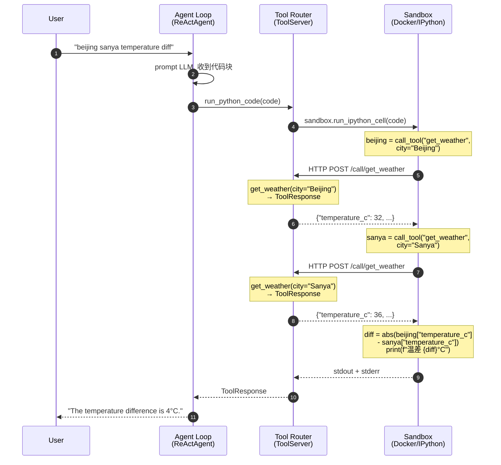
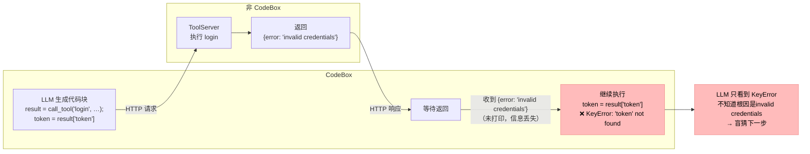

# CodeAct：让 LLM 用代码作为行动的 Agent 范式

## 1. 背景与原理

### 1.1 什么是 CodeAct？

CodeAct 是一种 Agent 范式，其核心思想是：**让 LLM 用编写和执行代码的方式来完成动作（Action），而不是通过结构化的函数调用（Function Calling/Tool Use）**。

在传统的 Tool-Use Agent 中，LLM 的每一步行动都需要选择一个工具并填写结构化的参数（通常是 JSON），由 Agent 框架负责调用工具并返回结果。而在 CodeAct 中，LLM 生成一段 Python 代码，代码中包含对工具的调用，整个代码块被送入一个沙箱执行，执行结果反馈给 LLM 作为下一步的输入。

### 1.2 核心区别

| 维度 | Tool-Use Agent | CodeAct Agent |
|------|---------------|---------------|
| 动作表示 | 结构化 JSON（工具名 + 参数） | 可执行代码 |
| 每步动作数 | 1 次 API 调用 | 可包含多次调用 + 控制流 |
| 中间结果处理 | 由框架管理，LLM 只看到返回值 | LLM 可在代码中用变量传递 |
| 灵活性 | 受限于预定义 schema | 可组合任意逻辑 |
| 错误处理 | 框架捕获异常，返回错误消息 | 代码中 try/catch，更灵活 |
| 执行环境 | 无/有限 | 完整 Python 沙箱 |

### 1.3 为什么 CodeAct 有吸引力？

1. **组合能力**：一次代码执行可以串联多个 API 调用，用 Python 变量传递中间结果，无需 LLM 记忆和回传
2. **控制流**：循环、条件判断等逻辑可以直接写在代码中，减少 LLM 的多轮交互次数
3. **数据处理**：可以直接在代码中对 API 返回值进行过滤、排序、计算等操作
4. **表达力**：代码是 LLM 最自然的输出格式之一，尤其对于代码能力强的模型
5. **确定性**：代码是确定性（deterministic）的——同样的代码、同样的输入，执行结果完全一致。这意味着 LLM 生成代码后，执行结果不受运行时随机因素影响，可复现、可调试。相比之下，Function Calling 模式中 LLM 每一步都需要重新决策，每步的随机性会累积，同一任务多次运行可能走完全不同的路径

## 2. 实现方式

### 2.1 架构概览

核心对比：**ReAct** 每次 LLM 只发出一个工具调用，每个动作之间都要回传给模型。**CodeAct** 让 LLM 生成一段程序，多个工具调用在一次代码执行中完成，之后才再次调用模型。

**ReAct** —— 每轮一个工具调用，无沙箱：



**CodeAct** —— 代码即动作，沙箱执行 + 回调宿主：



两者的关键差异：

| | ReAct | CodeAct |
|---|---|---|
| 动作单元 | 一次工具调用 | 一段代码 |
| N 次工具调用的 LLM 交互次数 | **N**（每次调用都要回传模型） | **1**（所有调用在一次执行中完成） |
| 是否需要沙箱 | 否 | 是 |
| Agent Loop ↔ Tool Router 关系 | Loop 逐个发出工具调用 | Router 处理来自沙箱的工具调用请求 |
| 凭证/会话存储位置 | Router（宿主） | Router（宿主）—— 相同 |
| 跨调用组合能力（循环、条件） | LLM 必须逐步规划和发出 | 沙箱内原生 Python 支持 |


### 2.2 以 Demo 为例理解架构

我们用 AgentScope CodeAct demo 中的"北京三亚温差"任务来具体说明上述架构。demo 中注册了 `get_weather` 和 `get_news` 两个宿主端工具，以及 `run_python_code` 沙箱执行工具。

**实际部署架构**：

```
┌─────────────────────────────────────────────────────── Host ────────────────────────────────────────┐
│                                                                                                     │
│  ┌───────────────────────────────────────────────────────────────────────────────────────────────┐  │
│  │  ReActAgent                                                                                   │  │
│  │  ┌──────────────┐  ┌──────────────────────────────────────────────────────────────────────┐   │  │
│  │  │ LLM (qwen)   │  │ Toolkit                                                              │   │  │
│  │  │              │  │  ├─ run_python_code  (from CodeAct Sandbox)                          │   │  │
│  │  │  sys_prompt: │  │  ├─ get_weather      (direct, host-side)                             │   │  │
│  │  │  CODEACT_    │  │  └─ get_news         (direct, host-side)                             │   │  │
│  │  │  SYSTEM_     │  │                                                                      │   │  │
│  │  │  PROMPT      │  │                                                                      │   │  │
│  │  └──────────────┘  └──────────────────────────────────────────────────────────────────────┘   │  │
│  └───────────────────────────────────────────────────────────────────────────────────────────────┘  │
│          │                                    │                      │                              │
│          │  UserAgent ←→ ReActAgent loop      │                      │  Direct tool calls           │
│          │                                    │                      │  (no sandbox)                │
│          │                                    ▼                      ▼                              │
│  ┌───────────────────┐         ┌─────────────────────────────────────────────────────────────────┐  │
│  │   UserAgent       │         │  ToolServer (FastAPI + Uvicorn)                                 │  │
│  │                   │         │  ┌──────────────────────────────────────────────────────────┐   │  │
│  └───────────────────┘         │  │  POST /call/{tool_name}                                  │   │  │
│                                │  │  └─ get_weather(**kwargs)  →  ToolResponse               │   │  │
│                                │  └──────────────────────────────────────────────────────────┘   │  │
│                                └───────────────────────┬─────────────────────────────────────────┘  │
│                                                        │  HTTP (Docker bridge IP)                   │
│                                                        │                                            │
└────────────────────────────────────────────────────────┼────────────────────────────────────────────┘
                                                         │
                          ┌──────────────────────────────┼───────────────────────────────────┐
                          │  Docker Sandbox              │                                   │
                          │                              ▼                                   │
                          │  ┌────────────────────────────────────────────────────────────┐  │
                          │  │  IPython Environment                                       │  │
                          │  │                                                            │  │
                          │  │  Pre-injected: call_tool(name, **kwargs)                   │  │
                          │  │    │                                                       │  │
                          │  │    │  HTTP POST → http://{host_ip}:{port}/call/{tool_name} │  │
                          │  │    └───────────────────────────────────────────────────────┼──┼──► ToolServer
                          │  │                                                            │  │
                          │  │  User code:                                                │  │
                          │  │    result = call_tool('get_weather', city='Beijing')       │  │
                          │  │    print(result['temperature_c'])                          │  │
                          │  │                                                            │  │
                          │  └────────────────────────────────────────────────────────────┘  │
                          └──────────────────────────────────────────────────────────────────┘
```

注意上图中的**双通道设计**：Toolkit 中既注册了 `run_python_code`（走沙箱执行），也注册了 `get_weather`、`get_news` 等宿主端工具（Agent 可直接调用，无需经过沙箱）。只有通过 `call_tool()` 在沙箱内调用的工具才经过 ToolServer 的 HTTP 链路。

**请求流程**：

1. **ReActAgent** 决定是直接调用宿主端工具，还是通过 `run_python_code` 执行代码
2. **直接调用**：Agent 通过 Toolkit 直接调用宿主端函数，无需沙箱
3. **代码执行**：Agent 调用 `run_python_code(code)` → `CodeActEnv.run_python_code()` → `sandbox.run_ipython_cell(code)`
4. 沙箱内代码使用 `call_tool(name, **kwargs)` 发送 HTTP 请求到宿主端 ToolServer
5. **ToolServer** 将调用分发到注册的函数并返回结果

**组件角色对照**：

| 组件 | 职责 | 我们的实现 |
|---|---|---|
| **Agent Loop** | 运行 LLM，决定何时执行代码 vs 返回结果 | AgentScope `ReActAgent` |
| **Tool Router** | 将工具名解析为具体运行时；持有密钥和会话句柄 | `ToolServer`（FastAPI HTTP） |
| **Sandbox** | 在隔离环境中执行 LLM 编写的代码；暴露工具代理 | Docker + IPython（`BaseSandboxAsync`） |
| **Tool Stubs** | 沙箱内的语言原生包装函数，通过 RPC 回调宿主 | `call_tool()`（HTTP proxy） |
| **Tools** | 执行实际工作；运行在物理上合理的位置 | Host-local function   |

**调用序列**：



关键观察：**步骤 4-9 中的两次 `get_weather` 调用都在一次代码执行内完成**，LLM 不需要在中间被再次调用。如果用 ReAct，LLM 需要先调 `get_weather(city="Beijing")`，拿到结果后再调 `get_weather(city="Sanya")`，最后再计算——至少 3 轮 LLM 交互，而 CodeAct 只需 1 轮。

**实际对话记录**：

**User**: beijing sanya temperature diff

**Friday** (Agent) 选择调用 `run_python_code`，生成代码：

```json
{
    "type": "tool_use",
    "name": "run_python_code",
    "input": {
        "code": "beijing_weather = call_tool('get_weather', city='Beijing')\nsanya_weather = call_tool('get_weather', city='Sanya')\ntemperature_diff = abs(beijing_weather['temperature_c'] - sanya_weather['temperature_c'])\nprint(f\"The temperature difference between Beijing and Sanya is {temperature_diff}°C.\")"
    }
}
```

**执行结果**（ToolResponse）：

```json
{
    "type": "tool_result",
    "name": "run_python_code",
    "output": [
        {
            "type": "text",
            "text": "The temperature difference between Beijing and Sanya is 4°C.\n"
        }
    ]
}
```

**Friday**: The temperature difference between Beijing and Sanya is 4°C.

### 2.3 核心实现

#### CodeActEnv 管理

`CodeActEnv` 是整个系统的核心，管理沙箱生命周期和工具代理注入：

```python
class CodeActEnv:
    """Manages a sandbox + host tool server."""
    ...

    def register_callable_tool(self, func, output_model=None):
        """Register a tool that can be called from the sandbox."""
        ...

    async def start(self):
        """Start ToolServer + Sandbox + inject call_tool proxy."""
        self.tool_server.start()
        self.sandbox = BaseSandboxAsync()
        await self.sandbox.__aenter__()
        # 注入 call_tool 到沙箱
        call_tool_code = _generate_call_tool_code(host_tool_url)
        await self.sandbox.run_ipython_cell(code=call_tool_code)
```

#### 沙箱侧 `call_tool` 代理函数

注入到沙箱中的 `call_tool` 是 LLM 在代码中调用工具的唯一入口：

```python
def call_tool(tool_name, **kwargs):
    """Call a tool on the host tool server by name."""
    import requests as _req
    _resp = _req.post(
        f"http://{HOST_IP}:{PORT}/call/" + tool_name,
        json={"arguments": kwargs},
        timeout=30,
    )
    _resp.raise_for_status()
    _data = _resp.json()
    if 'metadata' in _data and 'isError' not in _data:
        return _data['metadata']
    return _data
```

#### `run_python_code` 的工具描述

CodeAct 的关键在于：LLM 通过 `run_python_code` 这一个工具的描述来了解所有可用工具。工具描述中内嵌了完整的工具列表、输入输出 schema（参考[hyperlight](https://github.com/microsoft/agent-framework/tree/51ad460d5fcedba289d8cf0d41952de09c30eec2/python/packages/hyperlight/agent_framework_hyperlight)）。

**关键点**：LLM 必须知道每个工具的返回结构，才能在代码中正确解析和使用返回值。例如，`get_weather` 返回 `{'temperature_c': ..., 'condition': ...}`，LLM 需要这个字段名才能在后续代码中写 `result['temperature_c']`。如果没有 output schema，LLM 只能猜测返回值的字段名，极易出错。


```
Execute Python code in an IPython sandbox and return the output.

Inside the sandbox, `call_tool(name, **kwargs)` is ALREADY available.

Registered sandbox tools:
  - spotify_login(): Login to a Spotify account
    Input schema: {'properties': {'username': ..., 'password': ...}, 'required': [...]}
    Output schema: {'properties': {'access_token': ..., 'token_type': ...}}
  - search_songs(): Search for songs on Spotify
    Input schema: {'properties': {'query': ..., 'genre': ..., ...}}
    Output schema: {'items': [{'song_id': ..., 'title': ...}]}
  ...

Args:
    code (str): The Python code to be executed.
```


### 2.4 相关工作对比

以上是我们基于 AgentScope 的 CodeAct 实现。业界已有多种 CodeAct 实现，架构思路相似但各有侧重：

- **Microsoft Agent Framework + Hyperlight**：微软在 Agent Framework 中正式集成了 Hyperlight 作为 CodeAct 的后端实现。提供 `HyperlightCodeActProvider`，自动注入 `execute_code` 工具和 `call_tool(...)` 代理，支持 .NET 和 Python。亮点包括：沙箱内通过 `call_tool` 回调宿主工具、按 run 做 snapshot/restore 保持干净状态、工具审批机制（`ApprovalRequiredAIFunction`）、以及微软声称在工具密集型任务中可降低约 50% 延迟和 60% token 消耗
- **Hermes Agent**：Hermes 的 `code_execution_tool.py` 实现了"Programmatic Tool Calling (PTC)"——LLM 生成调用工具的 Python 脚本，工具调用通过 RPC（本地用 Unix Domain Socket，远程用文件轮询）回传给宿主进程执行。架构上与我们的实现非常相似：沙箱内脚本 → RPC 回调 → 宿主工具分发。Hermes 还支持远程执行后端（Docker/SSH/Modal/Daytona），并限制沙箱内可调用的工具白名单
- **LangGraph CodeAct**：LangChain 团队基于 LangGraph 实现的 CodeAct 架构，也是 Manus.im 背后使用的方案。核心特性包括：跨 turn 保持变量状态（Python locals 持久化）、支持自定义/LangChain/MCP 工具、可插拔的代码沙箱（推荐使用 LangChain Sandbox）。与我们的实现相比，LangGraph CodeAct 更侧重框架通用性，而我们更关注在 API 密集场景下的表现分析
- **AppWorld 原生 Agent**：AppWorld benchmark 本身就采用了"代码即动作"的设计——agent 输出 Python 代码，环境执行并返回结果。这是 CodeAct 的典型应用场景，也是我们实验的基线对比

## 3. 在 AppWorld 中的表现

### 3.1 AppWorld 简介

AppWorld 是 ACL'24 最佳资源论文，是一个可控制的 App 世界，用于评测函数调用和交互式编码 Agent：

- **9 个日常应用**：Spotify, Venmo, Phone, Gmail, Amazon 等
- **457 个 API**：覆盖音乐、支付、通讯、购物等场景
- **~100 个人物**：有完整的数字生活数据
- **评测方式**：给定自然语言任务，Agent 需自主调用 API 完成，最终与 ground truth 对比

我们的实验聚焦在 Spotify 相关任务上，使用了约 20 个 API 工具。

### 3.2 案例分析

#### 一个完美的结果

> **Task ID**: 82e2fac_1
>
> **Supervisor**: Joyce Weaver (joyce-weav@gmail.com)
>
> **Instruction**: What is the title of the most-liked song in my Spotify playlists.

LLM 在**一步代码执行**中完成了整个任务，共发起 **39 次 API 调用**，仅用 2 轮 LLM 交互即给出正确答案。

**Step 1** — LLM 生成一段完整代码，一次性串联所有操作：

```python
# 1. 获取 Spotify 密码
passwords = call_tool('show_account_passwords')
for entry in passwords:
    if entry['account_name'].lower() == 'spotify':
        spotify_password = entry['password']
        break

# 2. 用 supervisor 邮箱登录
response = call_tool('spotify_login', username='joyce-weav@gmail.com', password=spotify_password)
access_token = response['access_token']

# 3. 获取所有播放列表
playlists = call_tool('show_playlist_library', access_token=access_token)

# 4. 遍历每个播放列表的每首歌，追踪 like_count 最高的
for playlist in playlists:
    for song_id in playlist['song_ids']:
        song = call_tool('show_song', song_id=song_id)
        if song['like_count'] > max_like_count:
            max_like_count = song['like_count']
            most_liked_song_id = song_id

# 5. 输出答案并提交
most_liked_song = call_tool('show_song', song_id=most_liked_song_id)
call_tool('complete_task', answer=most_liked_song['title'])
```

**执行结果**：代码成功执行，`show_song` 逐一查到 song_id=78 的 "A Love That Never Was"（like_count=18）为最高，输出答案。

**Step 2** — LLM 总结：*"The title of the most-liked song in your Spotify playlists is 'A Love That Never Was'."*

**关键观察**：这正是 CodeAct 组合能力的体现——39 次 API 调用（1 次 `show_account_passwords` + 1 次 `spotify_login` + 1 次 `show_playlist_library` + 36 次 `show_song` + 1 次 `complete_task`）在一次代码执行中完成，LLM 只需被调用 2 次。如果用 ReAct 模式，至少需要 39+ 轮 LLM 交互。

#### 一个失败的结果

> **Task ID**: 82e2fac_1（同一任务，另一次运行）
>
> **Instruction**: What is the title of the most-liked song in my Spotify playlists.

同一次任务的另一次运行，LLM 在第 1 步就出错了，最终经过 **7 轮 LLM 交互**后放弃，标记任务失败。

**Step 1** — LLM 假设 `show_account_passwords()` 返回的字段中包含 `username`，写出：

```python
for account in credentials:
    if account['account_name'] == 'spotify':
        spotify_username = account['username']  # ❌ KeyError!
```

实际返回结构只有 `account_name` 和 `password`，没有 `username` 字段 → **KeyError: 'username'**。

**Step 2** — LLM 改用 `account.get('username', '')` 避免异常，但仍然没有 username → 输出 "Could not find Spotify credentials."

**Step 3** — LLM 转而调用 `show_api_doc` 查看 API 文档，确认返回结构确实没有 `username`。

**Step 4** — LLM 打印 `credentials` 观察，确认只有 `account_name` 和 `password`。

**Step 5** — LLM 尝试用 `account_name`（即 `"spotify"`）作为用户名登录 → `spotify_login(username='spotify', password='qge1k1L')` → **"Invalid credentials"**。

**Step 6** — LLM 放弃，调用 `complete_task(status='fail')`。

**Step 7** — LLM 总结失败原因。

**关键观察**：

1. **Output Schema 误读**：`show_account_passwords` 的 output schema 清楚写明只有 `account_name` 和 `password`，但 LLM 仍然假设有 `username` 字段。这说明即使提供了 output schema，LLM 也可能因为工具列表过长而忽略或混淆字段
2. **恢复路径错误**：LLM 在发现没有 `username` 后，没有联想到用 supervisor 的邮箱作为用户名（成功案例中 LLM 正确地用了 `joyce-weav@gmail.com`），而是用 `account_name` 凑数，导致认证失败
3. **偶然性**：同一任务、同一 prompt、同一工具集，仅因 LLM 对 schema 的不同理解，一次成功、一次失败。这体现了 CodeAct 模式下结果的**不稳定性**


### 3.3 CodeAct 的缺点

#### 3.3.1 Schema 相关问题

1. **必须有 Output Schema**：CodeAct 模式下，LLM 需要根据返回值结构来写后续代码（如 `result["access_token"]`）。如果缺少 output schema，LLM 只能猜测返回结构，极易写出错误的字段名或索引方式。相比之下，Function Calling 模式下即使没有 output schema，返回值也会被框架结构化地呈现给 LLM
2. **Function Calling 有输入校验，CodeAct 没有**：Function Calling 模式下，框架会自动校验参数名、类型、必填项，类型错误会被拦截并返回结构化错误；CodeAct 模式下，`call_tool("spotify_login", username="x", password="y")` 中的参数名、类型全靠 LLM 从文本描述中记忆，没有任何运行时校验——拼错参数名、传错类型、漏传必填参数都只会在运行时才暴露

#### 3.3.2 出错信息可能被吞

- Function Calling 模式下，工具的错误返回是结构化的（如 `{"isError": true, "message": "..."}`），LLM 容易理解和处理
- Code box中请求的tool_call如果缺少出错信息的打印，工具调用的返回值就完全丢失，LLM 无法知道调用是否成功、返回了什么




### 3.3 批跑综合结果

> [TODO: 插入批跑结果表格，对比 CodeAct vs 纯代码 vs Function Calilng 的成功率、步数、token 消耗]

### 3.4 Insight 分析

#### 3.4.1 当 Tool 多时，CodeAct 容易混淆出错

**问题**：`run_python_code` 的工具描述中需要列出所有可用的 `call_tool` 函数。当工具数量增多时（我们的实验中有 ~20 个），这个描述变得非常长，LLM 需要从一大段文本中准确找到目标工具，容易混淆工具名或参数。

**实例**：

> [TODO: 插入 Telemetry trace，展示 LLM 在 `call_tool` 中使用了错误的工具名或混淆了不同工具的参数]

**分析**：
- Function Calling 模式下，工具是独立注册的，LLM 只需从列表中选择，schema 是结构化约束
- CodeAct 模式下，所有工具信息都挤在一个 `run_python_code` 的描述文本中，LLM 必须自己"解析"这段文本来决定怎么写代码
- 工具越多，描述越长，干扰越大

#### 3.4.2 要求苛刻的 Tool 描述和 Schema；必须有 Output Schema

**问题**：CodeAct 模式下，LLM 必须根据文本描述中的 schema 来手写 `call_tool` 调用代码。如果 schema 描述不清晰或缺少 output schema，LLM 极易写出错误的调用代码。

**实例**：

> [TODO: 插入 Telemetry trace，展示 LLM 因为缺少 output schema 而无法正确解析返回值，或因为参数名拼写错误导致调用失败]

**分析**：
- Function Calling 模式下，参数校验由框架完成，类型错误会被自动拦截
- CodeAct 模式下，`call_tool("spotify_login", username="x", password="y")` 中的参数名、类型全靠 LLM 从文本描述中记忆，没有任何运行时校验
- Output schema 尤为关键——LLM 需要知道返回值的结构才能正确写后续代码（如 `result["access_token"]`）。缺少 output schema 时，LLM 只能猜测返回结构

#### 3.4.3 API 类 Tool 串联压力大，步骤过多容易出错

**问题**：AppWorld 的典型任务需要多步 API 串联：先查密码 → 登录获取 token → 用 token 查数据 → 修改数据 → 完成任务。在 CodeAct 中，这些步骤需要在一次代码执行中完成，或者分多步执行。

**实例**：

> [TODO: 插入 Telemetry trace，展示 LLM 试图在一次代码中串联 5+ 步 API 调用，其中某一步出错导致整个代码块失败]

**分析**：
- 串联的优势：一次代码可以完成多步操作，减少 LLM 交互轮次
- 串联的风险：代码中任何一步失败（如 API 返回错误），后续代码都会出错或无法执行
- 尤其是当中间步骤的返回值结构不确定时（如分页、空结果），LLM 很难在代码中写出健壮的错误处理

#### 3.4.4 出错信息没有合适出口

**问题**：当代码执行出错时，错误信息通过 stderr 返回，格式可能被截断或格式混乱，LLM 难以从中提取有用的调试信息。目前只能通过 `print(call_tool(...))` 来观察工具调用的返回值——如果 LLM 忘了 print，工具调用的输出就完全丢失，LLM 无法知道调用是否成功、返回了什么。

**实例**：
> [TODO: 插入 Telemetry trace，展示一个 Python 异常的 stacktrace 被截断或格式混乱，LLM 无法从中理解错误原因]

**分析**：
- Function Calling 模式下，工具的错误返回是结构化的（如 `{"isError": true, "message": "..."}`），LLM 容易理解
- CodeAct 模式下，代码中的异常可能来自 Python 运行时、沙箱环境、HTTP 调用等多个层面，错误信息格式不统一
- 我们的实现中，stderr 被包裹在 `<stderr>` 标签中，但 Python traceback 通常很长，关键信息容易淹没在调用栈中

#### 3.4.5 LLM 无法中间介入看单步执行效果

**问题**：在 Function Calling 模式下，每一步工具调用后 LLM 都能看到结果并决定下一步。但在 CodeAct 模式下，LLM 生成一段代码后，整个代码块一次性执行完毕，LLM 无法在代码执行过程中介入观察中间结果。

**实例**：

> [TODO: 插入 Telemetry trace，展示 LLM 写了一段长代码，中间某步的 print 输出和后续逻辑冲突，但 LLM 无法在中途调整]

**分析**：
- CodeAct 的核心 trade-off：少交互轮次 vs. 缺乏中间反馈
- 虽然 LLM 可以在代码中加入 `print()` 来观察中间结果，但这要求 LLM 有意识地做这件事
- 更关键的是，代码中的逻辑是 LLM 在执行前一次性写好的，无法根据中间结果动态调整
- 建议：可以要求 LLM 每次只写小段代码（如我们的 instruction 中说"Write small chunks of code"），但这又回到了多轮交互的模式，削弱了 CodeAct 的优势

#### 3.4.6 偶然性较大，小错误可能导致直接退出

**问题**：CodeAct 模式下，代码中的一个笔误（如 dict key 大小写不匹配、缺少引号）可能导致整个代码块抛异常。LLM 需要额外一轮来修复，但有时这个错误会被误解为 API 错误而非代码错误，导致 LLM 走入错误方向。

**实例**：

> [TODO: 插入 Telemetry trace，展示 LLM 写了 `result["AccessToken"]` 而实际 key 是 `access_token`，导致 KeyError，LLM 误判为 API 问题]

**分析**：
- Function Calling 模式下，参数校验由框架处理，LLM 不会因为 key 大小写问题出错
- CodeAct 模式下，LLM 需要精确记住 schema 中每个字段的名字和类型，一个字符的差异就可能导致运行时错误
- 这类错误具有"随机性"——同样的任务，LLM 可能一次写对，一次写错，导致结果不稳定

## 4. 总结与 Takeaway

### 4.1 什么时候适合用 CodeAct？

**适合的场景**：
1. **工具数量少**（< 10 个）：工具描述短，LLM 不容易混淆
2. **任务需要数据处理**：需要在 API 调用之间做计算、过滤、排序等操作
3. **工具 schema 简单明确**：输入输出结构清晰，字段名直观
4. **任务步骤相对独立**：每步操作不依赖上一步的复杂结果
5. **代码能力强的 LLM**：模型本身擅长写代码

**不适合的场景**：
1. **工具数量多**（> 15 个）：描述过长，LLM 容易混淆
2. **API 串联步骤多**（> 3-4 步串联）：出错概率急剧上升
3. **API 返回结构复杂**：嵌套深、字段多、大小写敏感
4. **需要精细的错误处理**：每个步骤都可能失败，需要针对性处理
5. **对稳定性要求高**：随机性的代码错误不可接受

### 4.2 如何将 CodeAct 的能力发挥到最大？

1. **精简工具集**：每次只注册任务相关的工具，减少描述长度和混淆
2. **提供完整的 Output Schema**：让 LLM 知道返回值的精确结构
3. **要求 LLM 写小段代码**：每步只做一件事，观察结果后再继续
4. **在代码模板中提供示例**：在 `run_python_code` 的描述中加入常用模式的代码片段
5. **增强错误信息的可读性**：对沙箱中的异常进行格式化和截断，突出关键错误
6. **增加重试机制**：当代码执行失败时，自动重试或提供更友好的错误提示
7. **混合模式**：查询类工具用 Function Calling 直接调用，操作类工具用 CodeAct 代码执行
8. **注入常用辅助代码**：如 `call_tool` 一样，预先注入常用的数据处理函数

### 4.3 对 Agent 开发者的建议

| 建议 | 原因 |
|------|------|
| 先用 Function Calling 验证 | 确认工具链路通畅后再迁移到 CodeAct |
| 工具描述越精确越好 | LLM 完全依赖描述来写代码，模糊的描述 = 错误的代码 |
| 不要贪多 | 宁可分 3 步小代码执行，也不要 1 步大代码冒险 |
| Output Schema 是必需品 | 没有它，LLM 无法正确写后续数据处理代码 |
| 监控代码执行的成功率 | 区分"API 错误"和"代码错误"，针对性优化 |
| 保持工具名和参数名的一致性 | 避免 `spotify_login` vs `login` 这类命名不一致 |

---

## 参考文献

1. Xingyao Wang, Yangqiu Song, et al. "CodeAct: A Code Action Framework for LLM Agents." arXiv:2402.01030, 2024.
2. DSPy CodeAct Agent Architecture. https://github.com/ekzhu/dspy/blob/claude/dspy-rlm-tool-execution-F7n9h/docs/docs/deep-dive/codeact-agent-architecture.md
3. Microsoft Agent Framework - Hyperlight CodeAct. https://learn.microsoft.com/en-us/agent-framework/integrations/hyperlight
4. NousResearch Hermes Agent - Code Execution Tool. https://github.com/NousResearch/hermes-agent/blob/main/tools/code_execution_tool.py
5. LangGraph CodeAct. https://github.com/langchain-ai/langgraph-codeact
6. Harsh Trivedi et al. "AppWorld: A Controllable World of Apps and People for Benchmarking Interactive Coding Agents." ACL 2024 (Best Resource Paper).

---

> **文档状态**：初稿，待补充 Telemetry trace 实例和批跑结果数据
